## First Project

[First Project Data ](First_project)

-   Create Table with columns:
    -   `weight`
    -   `height`
    -   `sex`
-   Add Color manager 
-   Add Scatter Plot to visualize the data

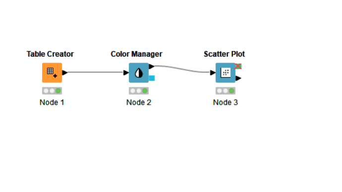

## Use Excel Reader for read excel files.
-    Configure it. Make sure that first row is showing the header. 
## Partitioning the data to train and test.
- Use ```Partitioning``` block to partition the data.
- You can set the train and test size with the ```Relative`` and ``Absolute`` options.

## Decision Tree Learner and Decision Tree Predictor
- Use ```DecisionTreeLearner``` block to learn the decision tree.
- Use ```DecisionTreePredictor``` block to predict the data.

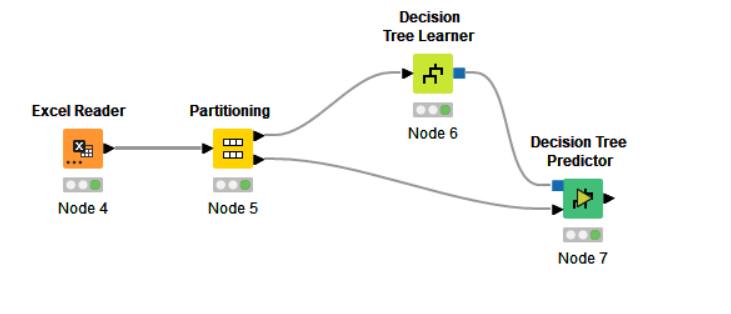

## Data Accessing

[Data Accesing](DataAccessing)

- Create a new workflow called ```DataAccessing```
- Add a new  ```Excel Reader``` block to read the data.
- Add a new  ```File Reader``` block to read the data (csv file).
- Create a table with ```Table Creator``` block.

## Basic Visualization

- Use ```Scatter Plot``` block to visualize the data.
- Use ```Color Manager``` block to color the data.
- Use ```Line Plot``` block to visualize the data in the csv file.
- Use ```Pie Chart``` block to visualize in form of a pie chart.

## Basic Data Manipulation and Preprocessing.

### Row Filtering and Missing Values

-  Use ```Row Filter``` block to filter applying a condition to the data.
- Use ```Rule Based Filter``` block to filter the data based on the rules.
    ```
    $Height$>0 =>  TRUE 
    $Height$<0 =>  FALSE
    $Height$>0 AND $Weight$ >= 50 => TRUE 
    $Height$>0 AND $Weight$ >= 50 AND ($Height$ <220 OR $ID$ >5) => TRUE 
    ```
### Column Filter

- Use ```Column Filter``` block to filter the data based on the column name.

### Concatenate

- Use ```Concatenate ``` block to concatenate data.

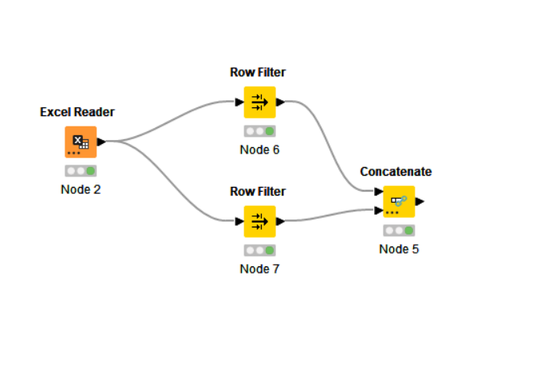

### Joiner

- Use ```Joiner ``` block to join data.

### Group by

- Use ```Groupby``` block to do aggregate functions.
- Group variables using ```Groups``` setting.
- In ```Manual Aggregation``` setting, you can specify the aggregate function.

### String Replacer

- Use ```String Replacer``` block to replace values in string cells if they match a certain wildcard pattern.

### Math Formula

- Use ```Math Formula``` block to apply mathematical formulas to the data.This node evaluates a mathematical expression based onthe values in a row.

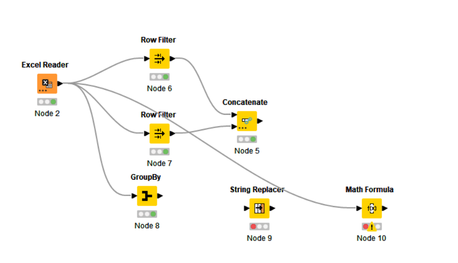

### Auto Binner

- Use ```Auto Binner``` block to bin the data.

### Numeric Binner

- Use ```Numeric Binner``` block to bin the data based on the numeric values.

### Normalizer

- Use ```Normalizer``` block to normalize the data.

### Pivoting

- Use ```Pivoting``` block to pivot the data.
- ```Groups``` setting specify what you want to see in the row header.
- ```Pivot``` setting specify what you want to see in the column header.

### Metanode

Meta nodes are nodes that contain subworkflows, i.e. in the workflow they look like a single node, although they can contain many nodes and even more meta nodes. They are created with the help of the meta node wizard. You can open the meta node wizard by either selecting "Node/Add Meta Node"
from the menu or by clicking the button with the meta node icon in the toolbar (workflow editor must be active).

### Data Generators

Creates random data containing some clusters for Parallel Universes. The data contains a certain fraction of noise patterns and data that is generated to clusters (all clusters have the same size). The data is normalized in [0, 1].

### Column Combiner

- Use ```Column Combiner``` block to combine the data.

### Cell Splitter

- Use ```Cell Splitter``` block to split the data.

### Type conversion

- Use ```String to Number``` block to convert the data.


## Modeling:

Visit [Modeling](https://www.knime.com/nodeguide/analytics/classification-and-predictive-modelling) for more details.

## Classification models:

[Refers to the folder](Classification)

#### Naive Bayes:

- Use ```Naive Bayes Learner``` block to train the model.
        -Limit your nominal values to the ones you want to use (```Nominal Values``` setting).
- Use ```Naive Bayes Predictor``` block to predict the data.

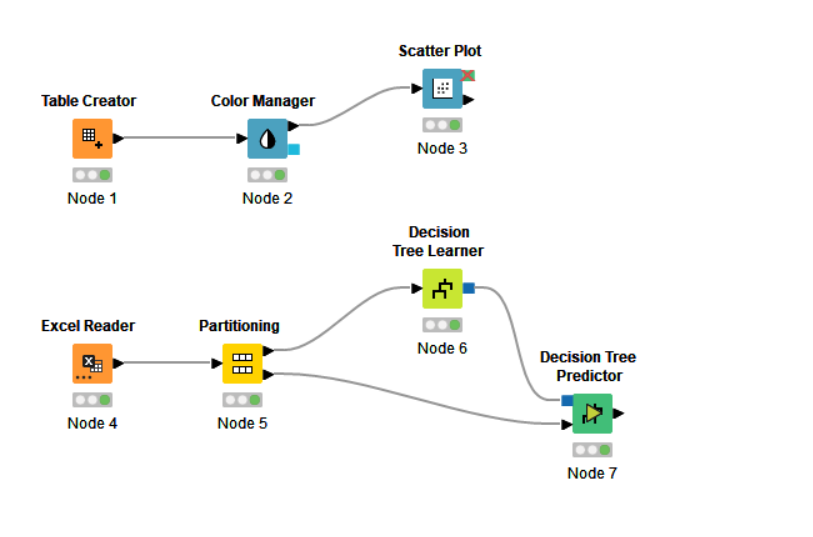


### Decision Tree:
Decision Tree : Decision tree is the most powerful and popular tool for classification and prediction. A Decision tree is a flowchart-like tree structure, where each internal node denotes a test on an attribute, each branch represents an outcome of the test, and each leaf node (terminal node) holds a class label. 
 
A decision tree for the concept PlayTennis. 
Construction of Decision Tree : 
A tree can be “learned” by splitting the source set into subsets based on an attribute value test. This process is repeated on each derived subset in a recursive manner called recursive partitioning. The recursion is completed when the subset at a node all has the same value of the target variable, or when splitting no longer adds value to the predictions. The construction of a decision tree classifier does not require any domain knowledge or parameter setting, and therefore is appropriate for exploratory knowledge discovery. Decision trees can handle high-dimensional data. In general decision tree classifier has good accuracy. Decision tree induction is a typical inductive approach to learn knowledge on classification. 

- Decision Tree Learner Configuration:
    -   Select the target in the ```Class Column``` setting.
    -   Select the quality measure with ```Quality measure``` setting.
    -   Avoid overfitting using ```Min number records per node``` setting.
    -   You can force the root with ```Force Root split column``` setting.

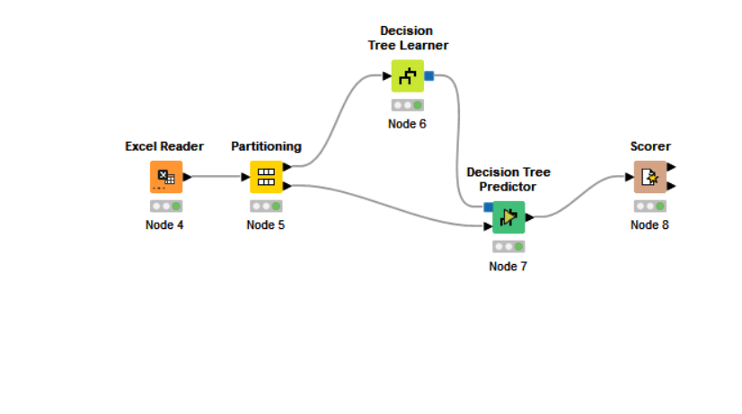


### K-Nearest Neighbor Algorithm
-   Lazy learner:

        Just store Data set without learning from it

        Start classifying data when it receive Test data

        So it takes less time learning and more time classifying data

-   Eager learner:

        When it receive data set it starts classifying (learning)

        Then it does not wait for test data to learn

        So it takes long time learning and less time classifying data


- Check ```Output class probabilities``` setting to see the probability of the class.

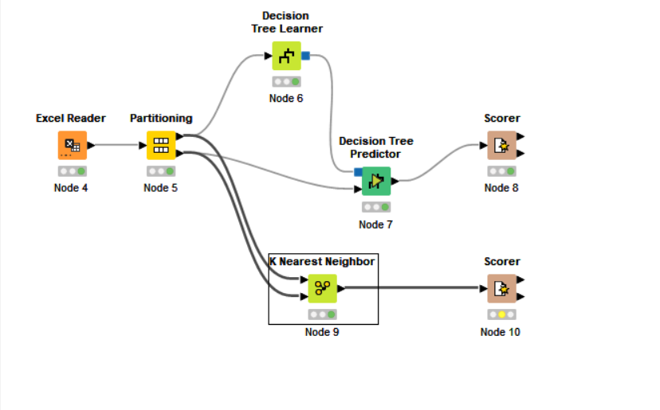


### Distance Metrics

- You can use ```Numeric Distances``` setting to use the Euclidean distance or the Manhattan distance.
- You can use ```K Nearest Neihbor (Distance Function) ``` block to use the previous distance metric.
- Don't forget about normalization before using the distance metric.
- You can use ```Java Distance``` block to use the distance metric in Java.

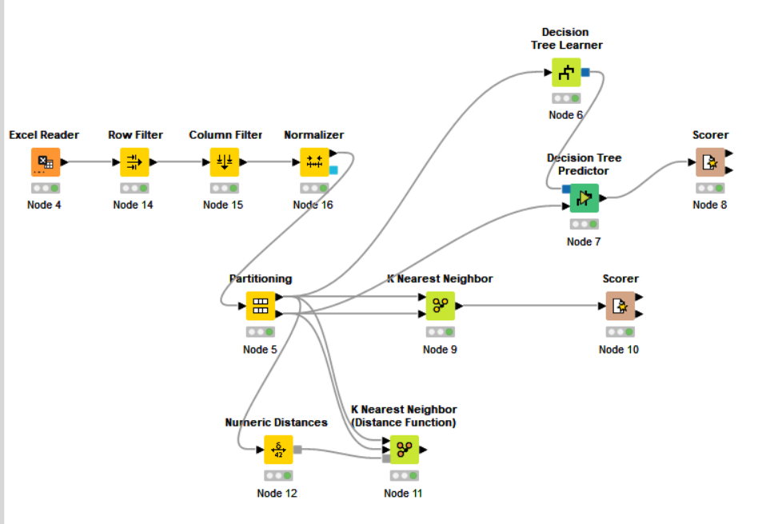

### Support-Vector-Machines

“Support Vector Machine” (SVM) is a supervised machine learning algorithm that can be used for both classification or regression challenges. However,  it is mostly used in classification problems. In the SVM algorithm, we plot each data item as a point in n-dimensional space (where n is a number of features you have) with the value of each feature being the value of a particular coordinate. Then, we perform classification by finding the hyper-plane that differentiates the two classes very well (look at the below snapshot).

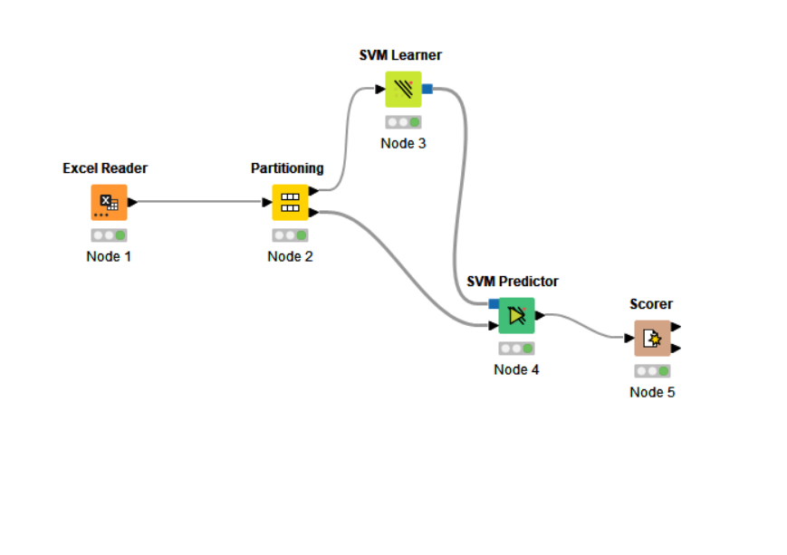

### Example of all the models

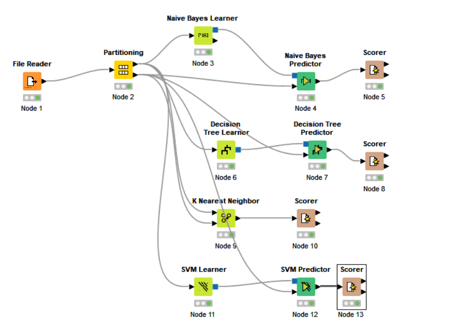

## Comparing Classification Algorithms
### 1. Problem Type

    All the algorithms considered in here are for the classification. We are going to revisit the algorithms for different problem types in the future.

### 2. Interpretable?

    One major criteria about the machine learning algorithms is the interpretability. Some algorithms are extremely complex and even if they yield the best results, sometimes we do not prefer to use them because it is not easy to understand or explain. So the list of algorithms and their interpretability's:

    Naive Bayes : Sometimes : It is a probabilistic algorithm and remember the theoretical part of our courses. It is explainable but not easy all the time. Especially if you have high number of attributes in your data set it gets more complex to explain.

    Decision Trees: YES: One major advantage of decision trees is the interpretability. I can easily say they are the best algorithms to explain something.

    KNN: YES: it is as simple as explaining the distance between two points. So, if you can find a good result in KNN, you can just visualize the data points on a board, get a ruler and show how they are classified.

    SVM: Sometimes: If the problem is linearly separable, and if you can find a border line between the classes, than you can draw the line between the classes and explain how you find the classification. Unfortunately, it gets more complex with the increasing number of attributes and class labels.

    Logistic Regression: Sometimes: Sometimes it is really easy to understand and explain the outcomes of logistic regression. For example if the problem is binary classification and if you have only 1 attribute, it would be a very easy job to explain. On the other hand, by the increasing number of labels in your classification or by the increasing number of attributes, it gets more and more complex.

### 3. Average Accuracy

    Unfortunately, all the algorithms we have covered until now have low accuracy. In the future classes we are going to cover some techniques like ensemble or neural networks and we are going to talk about why we have higher accuracies.

### 4. Training Speed

    Keep in mind that, these algorithms are very basic and simple algorithms. This brings up a very important speed advantage. So we can say all the algorithms in the list have short training times.

### 5. Prediction Speed

    All the algorithms results the predictions in a short time. Only for the K-NN and if you go with the lazy learning, you might  have difficulty about the prediction time.

### 6. Small number of observations

    KNN: No, requires a certain number of data points, depending on the value of K parameter

    Decision Tree: No, requires some data points to create decision nodes in order to split data set into small trees.

    For the rest of the algorithms: Naive Bayes, SVM or Logistic Regression, you can easily create a decision boundary even if you have small number of data points in your data set.

### 7. Noisy Data

    If a data point is noisy, like we have 250 in height or 300 in weight, the algorithm may be immune to the problem and can handle the situation. All the algorithms except Naive Bayes are weak for the problems like noisy data because they only assume a data point as it is.

    KNN will classify any data point close to the noisy data with the class of noisy data point and will not consider any exception. For the KNN, a noisy data is just another data point and KNN has no immunity against noisy data.

    Decision tree will classify the noisy data as a separate leaf in the tree and any data classification will easily go into the branch of noisy data if it is just close enough. This is also a problem for DT and it can not handle noisy data as a problem and keeps classifying the data points even if they are noisy.

    SVM will just consider the data point in order to find a separation border as any other data points. SVM can not handle the noisy data problem.

    On the other hand the probability of a noisy data in Naive Bayes will be considered as a exception and will not create a problem.

    ### 8. Requires Scaling?

    Only KNN and SVM needs scaling because the parameters are compared with each other during the distance calculation. Don't forget we have normalized the attributes in order to create a better distance metric in KNN. Similarly, SVM also uses the distance and I would strongly recommend you to use scaling / normalization before the SVM algorithm.

    On the other hand, DT, NB or LR never considers axises together. Each axis for the decision tree Naive Bayes or Logistic regression is a completely different story to take care of.

## Association rule learning 
    Association rule learning is a rule-based machine learning method for discovering interesting relations between variables in large databases. It is intended to identify strong rules discovered in databases using some measures of interestingness.[1] In any given transaction with a variety of items, association rules are meant to discover the rules that determine how or why certain items are connected.

    Based on the concept of strong rules, Rakesh Agrawal, Tomasz Imieliński and Arun Swami[2] introduced association rules for discovering regularities between products in large-scale transaction data recorded by point-of-sale (POS) systems in supermarkets. For example, the rule {\displaystyle \{\mathrm {onions,potatoes} \}\Rightarrow \{\mathrm {burger} \}}\{{\mathrm  {onions,potatoes}}\}\Rightarrow \{{\mathrm  {burger}}\} found in the sales data of a supermarket would indicate that if a customer buys onions and potatoes together, they are likely to also buy hamburger meat. Such information can be used as the basis for decisions about marketing activities such as, e.g., promotional pricing or product placements.

    In addition to the above example from market basket analysis association rules are employed today in many application areas including Web usage mining, intrusion detection, continuous production, and bioinformatics. In contrast with sequence mining, association rule learning typically does not consider the order of items either within a transaction or across transactions.

    The association rule algorithm itself consists of various parameters that can make it difficult for those without some expertise in data mining to execute, with many rules that are arduous to understand.[3]

    Despite this, association rule learning is a great system for predicting the behavior in data interconnections. This makes it a noteworthy technique for classification, or discovering patterns in data, when implementing machine learning methods.

    - You can use ```Association Rule Learner ``` to learn association rules from a dataset.

 ## Clustering /Segmentation

    - Centroid Models: K-Means
    - Connectivity Models: Hierarchical Clustering
    - Distribution Based Models
    - Density Models: DBSCAN

### K-Means algorithm

It's an algorithm that works using central points to cluster the data points.
First at all, we need to define the central points (K), then we need to find the closest point to each of the central points.
Then we recalculate the central points again until the central points are the same as the previous ones or until the number of iterations is reached.

### Optimum number of clusters (k value) and WCSS (Within Cluster Sum of Squares)

When you have more k values, the WCSS is going to be lower.

### K-Means in Knime

- You can use ```K-means``` block to applied the algorithm.
- You can set the number of clusters using the ```Number of Clusters``` parameter.

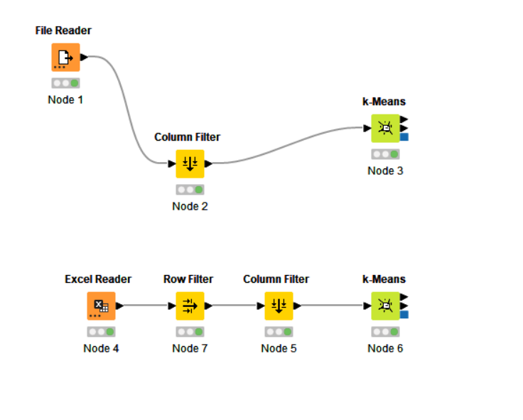

### Optimizing with Grid Search

- You can use ```Table Column to Variable``` block to convert the table column to a variable.
- You can use ```Table Row to Variable Loop Start``` block to convert the table row to a variable loop.
- You can use ```Entropy Scorer``` block to measure the success of the clustering.
- You can use ```Loop end``` block to collect intermediate results.

You can see how the entropy score changes with the number of clusters.

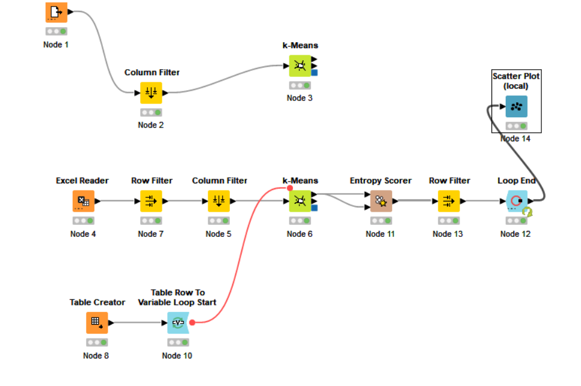


### Hierarchical Clustering

In data mining and statistics, hierarchical clustering (also called hierarchical cluster analysis or HCA) is a method of cluster analysis which seeks to build a hierarchy of clusters. Strategies for hierarchical clustering generally fall into two types:

-   Agglomerative: This is a "bottom-up" approach: each observation starts in its own cluster, and pairs of clusters are merged as one moves up the hierarchy.
-   Divisive: This is a "top-down" approach: all observations start in one cluster, and splits are performed recursively as one moves down the hierarchy.
In general, the merges and splits are determined in a greedy manner. The results of hierarchical clustering[2] are usually presented in a dendrogram.

- You can use ```Hierarchical Clustering ``` block to applied the algorithm.
- Select the linkage type using the ```Linkage Type``` parameter.


### DBSCAN algorithm

    DBSCAN is a density-based clustering algorithm that is used to group the objects of a data set into a number of clusters. The algorithm is based on a concept of density, which is the inverse of separation. The algorithm is very similar to the K-means algorithm, but it is more efficient in terms of speed and memory.

- DBSCAN needs distance metric to be used. We can add it to the algorithm using the ```Numeric Distances`` block. We can decided to use Euclidean distance or Manhattan distance.
- DBSCAN requires Epsilon value to be used. We can add it to the algorithm using the ```Epsilon``` parameter in ```DBSCAN``` block.


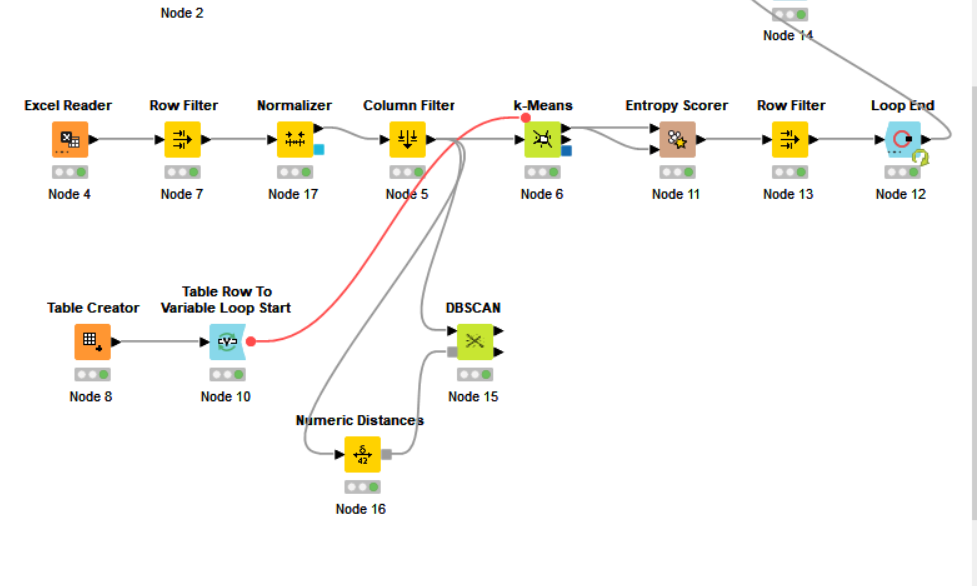

## Comparison of Clustering Algorithms

After covering the clustering algorithms, we are comparing Hierarchical Clustering vs K-Means Algorithm

### 1. Algorithmic Background:

    Both Hierarchical and K-Means algorithms are based on the distance based approach. Basically, the algorithms create clusters by the distances between the data points and almost any distance metric can be deployed ilke euclidean, Manhattan, Minkowski or Chebyshev distances (please refer to the distance metrics course in KNN under classification chapter).

    The philosophy of the algorithms are different on the other hand. Hierarchical clustering is based on the hierarchy of the data points. So basically a data point is a member of cluster in an hierarchical order.

    On the other hand, for the k-means algorithm, the philosophy is the similarity. K-Means goes after the similar or dissimilar data points.

    In the literature, the k-means algorithm is called as centroid based model and hierarchical clustering is called as connectivity based algorithm. Also, we have two more categories for the clustering algorithms, which are the distribution based and density based models but they are mostly useful for streaming data problems.

    Finally, the DBSCAN algorithm is also based on the distance based metrics. The connections between core data points or the dissimilarity of noise and core data point is all determined by the distances between data points.

### 2. Data Set Size and Time Performance
    
    Both k-means and hierarchical clustering algorithms have advantages and disadvantages. One major difference is about the data set size. Hierarchical clustering works very good in small data set sizes, but on a large data set, hierarchical clustering can not work or takes very long time to execute. On the other hand, k-menas has advantages on the larger data sets. So, as a summary, I can suggest you to use k-means if you have a very large dataset.

    From the benchmarks, the DBSCAN algorithm has some performance advantages over k-means. Also there is a special version of DBSCAN, which is called as HDBSCAN (hierarchical version of DBSCAN) and this special version has major advantage over k-means in many benchmarks. But for now, it is better to say, both DBSCAN and K-Means have advantages over hierarchical clustering.
### 3. Multiple execution stability
    In K Means clustering, since we start with random choice of clusters, the results produced by running the algorithm multiple times might differ. While results are reproducible in Hierarchical clustering and DBSCAN algorithms.

### 4. Initial Parameters
    K Means clustering requires prior knowledge of K i.e. no. of clusters you want to divide your data into. But, you can stop at whatever number of clusters you find appropriate in hierarchical clustering by interpreting the dendrogram. Although there are other versions of k-means algorithms like x-means, they are just a simple grid search version of k-means.

    On the other hand, DBSCAN algorithm does not require any initial parameters to predefine number of clusters. DBSCAN algorithm has an advantage for the number of clusters but the parameters epsilon and minpts are very crucial in DBSCAN execution.

### 5. Hard vs Soft Clustering
    We also have fuzzy clustering, where the membership of a data point is not certain to a cluster, instead the clusters have fuzzy borders. There are special versions of k-means for the fuzzy borders and called as fuzzy c-means.

## Linear Regression
    Linear regression analysis is used to predict the value of a variable based on the value of another variable. The variable you want to predict is called the dependent variable. The variable you are using to predict the other variable's value is called the independent variable.

## Predicting Weight with Height

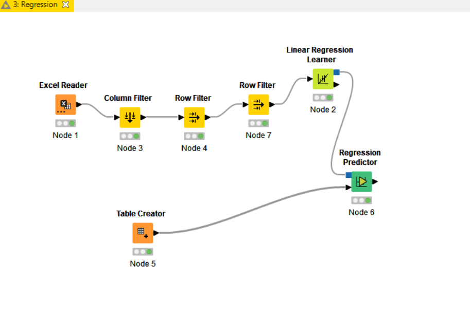

## Error calculation

    Absolute error: The absolute error is the difference between the predicted value and the actual value.
    Squared error: The squared error is the square of the absolute error.
    RMSE: The root mean squared error is the square root of the squared error.
    
-   You can use ```Numeric Scorer``` block to calculate many types of error.

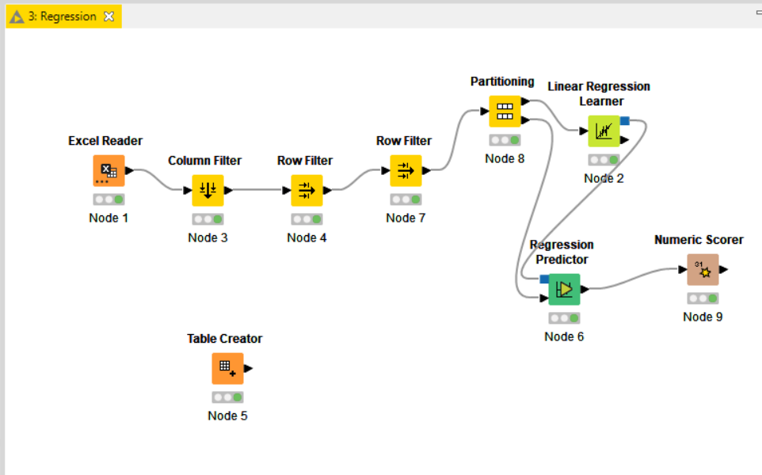

## Multiple Linear Regression

    Multiple linear regression is used to predict the value of a variable based on the value of multiple variables.

    Example: Predicting the weight of a person based on his height and weight.


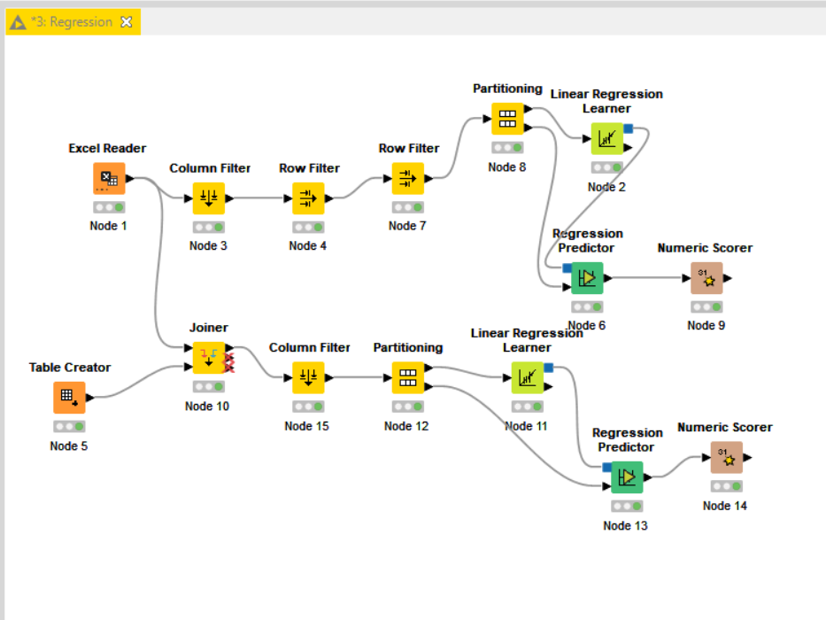


## Polynomical regression

    Polynomial regression is used to predict the value of a variable based on the value of multiple variables.
    In polynomial regression is a form of regression analysis in which the relationship between the independent variable x and the dependent variable y is modelled as an nth degree polynomial in x.

    Example: Predicting the weight of a person based on his height and weight.


-   You can set the  max grade of the polynomial regression using the ```Maximum Polynomial degree``` parameter.
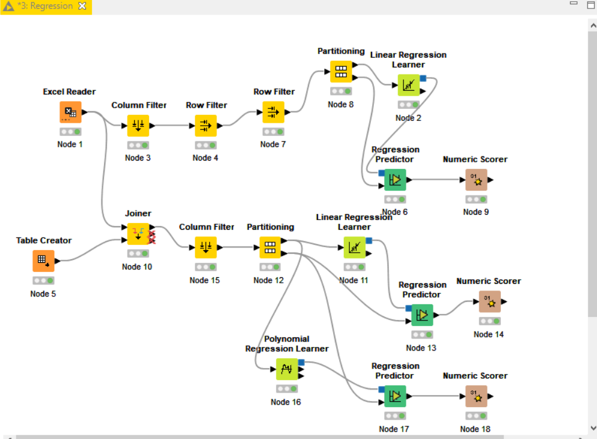

## Regression by Decision Tree
    Decision tree builds regression or classification models in the form of a tree structure. It breaks down a dataset into smaller and smaller subsets while at the same time an associated decision tree is incrementally developed. The final result is a tree with decision nodes and leaf nodes.

-   You can use ```Simple Regression Tree Learner``` block to build a decision tree.
-   You can use ```Simpre Regression Tree Predictor``` block to predict the value of a variable based on the value of multiple variables.
-   As usual you can use ```Numeric Scorer``` block to calculate the error.
-   Missing values can be handled using ```XGboost``` in the ```Simple Regression Tree Learner``` parameter.
-   You can limit the number of trees in the decision tree using the ```Limit number of levels``` parameter.

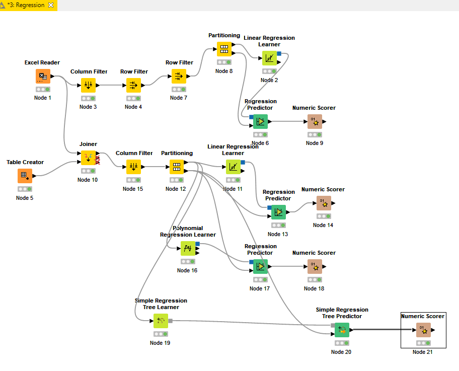

## Comparison of Regression Models
We have covered below regression models and we are going to compare the models in this article:

    1. Linear regression has an assumption of the axises of data set has a linear relation. For example if the data set has 2 dimensions (axises) only, then the assumption of linear regression is, there is a relation between two axises which can be formalized as y = ax + b. The regression problems are mainly used in time series and forecasting, so if this is the case one of the dimensions becomes temporal information, such as year or months, and the linear regression gives us the trend.

        Linear regression is very useful for understanding the trend of the data set and it can even predict long term values with the given trend.

        Linear regression has two types in the literature:

        1.1. Single Variable Linear Regression (or simply the Single Linear Regression in some sources).

        1.2. Multiple Variable Linear Regression (or simply the Multiple Linear Regression in some sources).

        The only difference is the number of independent variables and the number of variables increases the dimension of linear formula only.

    2. Polynomial regression is also useful for predicting short term outcomes or missing values. Despite of linear regression, the polynomial regression has a very bad outcome in long term prediction for most of the cases.

    Don't forget, the linear regression is a special type of polynomial regression where the degree of regression is equal to 1.

    Pros:

    Fast to model and is particularly useful when the relationship to be modeled is not extremely complex and if you don’t have a lot of data.

    Linear regression is simple to understand which can be very valuable for business decisions.

    Cons:

    For non-linear data, polynomial regression can be quite challenging to design, as one must have some information about the structure of the data and relationship between feature variables.

    As a result of the above, these models are not as good as others when it comes to highly complex data.

    3. Simple Regression Tree

    Regression trees are not useful in the real life problems. You can consider them as a step before the random forest regression and they are extremely important to understand the tree approach on the data set space.

    In the random forest approach the decisions of regression trees are aggregated (most of the time we get the average of regressions) and random forest approach was the one of the most favorite approaches once.

    Pros:

    Great at learning complex, highly non-linear relationships. They usually can achieve pretty high performance, better than polynomial regression and often on par with neural networks.

    Very easy to interpret and understand. Although the final trained model can learn complex relationships, the decision boundaries that are built during training are easy and practical to understand.

    Cons:

    Because of the nature of training decision trees they can be prone to major overfitting. A completed decision tree model can be overly-complex and contain unnecessary structure. Though this can sometimes be alleviated using proper tree pruning and larger random forest ensembles.

    Using larger random forest ensembles to achieve higher performance comes with the drawbacks of being slower and requiring more memory.

    4. Neural Network or Deep Learning Approach

    This approach uses the neurons and reinforced learning most of the time. The main idea behind the algorithm is finding the optimum parameters for the neuron activation functions or the weights on the synapses. Because it has a reinforced learning approach, it can yield much better machine learning models at the end and it can go beyond the supervised learning or it can adapt itself to the dynamic environments and it can also model the hidden relations in the environment, like stock markets. On the other hand this advantage has a drawback and it requires huge amount of data and its training time is much longer than the rest of the algorithms.

    Pros:

    Since neural networks can have many layers (and thus parameters) with non-linearities, they are very effective at modelling highly complex non-linear relationships.

    We generally don’t have to worry about the structure of the data at neural networks are very flexible in learning almost any kind of feature variable relationships.

    Research has consistently shown that simply giving the network more training data, whether totally new or from augmenting the original data set, benefits network performance.

    Cons:

    Because of the complexity of these models, they’re not easy to interpret and understand.

    They can be quite challenging and computationally intensive to train, requiring careful hyper-parameter tuning and setting of the learning rate schedule.

    They require a lot of data to achieve high performance and are generally outperformed by other ML algorithms in “small data” cases.


## Sample Problem/Stock Market Prediction

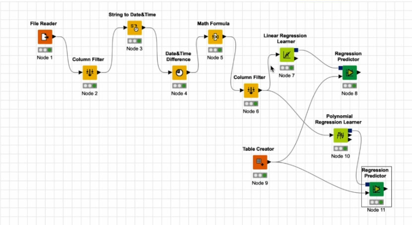
